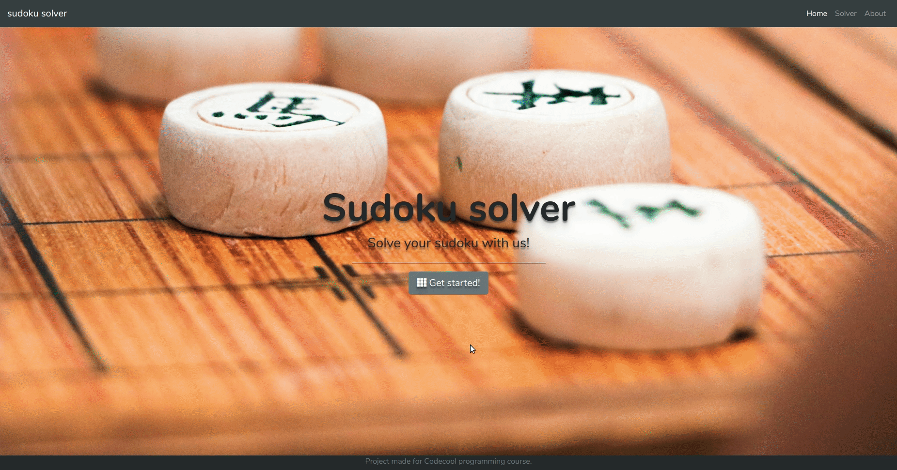

### Sudoku solver

  Web app which solve sudoku with multithread approach.
  
### Requirements
1.

### Using the API
1. Choose file in txt format with sudoku to solve.
2. Click Upload button.
3. Click Solve button to solve sudoku.

### Built with:
1. Maven - Dependency Management
2. Spring Boot
3. Travis CI
4. Heroku
5. Bootstrap 4

### Tools:
1. IntelliJ IDEA
2. Visual Studio Code

### Authors: 
- Bartosz Pyrz [Github profile](https://github.com/Czakero)
- Dawid Grygier [Github profile](https://github.com/cyan0505)
- Damian Szwajkos [Github profile](https://github.com/Szwajcii)
- Tomek Pieczkowski [Github profile](https://github.com/Pieczkowski)
